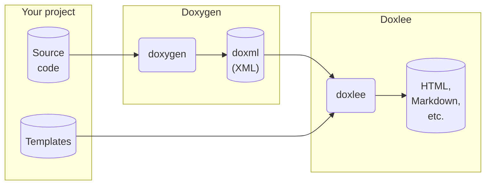

# Doxlee

[](https://github.com/pcolby/doxlee/actions/workflows/build.yaml?query=branch%3Amain)
[](https://github.com/pcolby/doxlee/actions/workflows/static.yaml?query=branch%3Amain)
[](https://app.codacy.com/gh/pcolby/doxlee/dashboard)
[](https://coveralls.io/github/pcolby/doxlee?branch=main)

Doxlee renders source code documentation by applying text templates to [Doxygen]'s XML output.



[Doxygen] does support using your own custom headers, footers, and style sheets, which can achieve a fair amount of
flexibility already ([Doxygen Awesome] is a great example). But those options do not allow fundamental restructuring of
things like the navigation menus, sidebar and breadcrumbs. So if [Doxygen]'s built-in options are sufficient for your
desired output, then you should definitely use them directly. But if you do desire more control over the generated
documentation, then feel free to explore this project :)

### Text Templates

Doxlee uses a text template language that is very similar to [Django templates]. Specfically, Doxlee uses either the
[Grantlee] or [Cutelee] library (the former is a Qt6-compatible fork of the former).

> [!NOTE]
> Doxlee began using the [Grantlee] library with Qt5. However, the [Grantlee] author has moved the library to [KDE],
> where it is now known as [KTextTemplate], and the original [Grantlee] library has been retired. Meanwhile, the
> [Cutelyst] project has forked [Grantlee] to [Cutelee], and ported it to Qt6. Today, Doxlee supports both [Grantlee]
> (with Qt5) and [Cutelee] (with Qt6). Doxlee will most likely support [KTextTemplate] too, when that library becomes
> more readily available.

You can find the template language documention [here](https://pcolby.github.io/cutelee/for_themers.html). You can also
have a look at some of the [demo](demo) templates.

## Installation

\todo

For now, see [Building from Source](#building-from-source) below.

## Usage

Update your [Doxygen] configuration file to enable XML output:

```
GENERATE_XML           = YES
XML_OUTPUT             = <path-to-xml> # Optional; defaults to xml.
XML_PROGRAMLISTING     = YES # Optional; set to YES to include source code in the documentation.
XML_NS_MEMB_FILE_SCOPE = YES # Optional; set to YES to include namespace documentation, if any.
```

Generate the documentation:

```sh
doxygen [configname]
doxlee -i <path-to-xml-> -o <path-to-write-output> -t <path-to-theme>
```

There are some other basic options too. Use `--help` to see them.

```
Usage: ./src/doxlee [options]
Render Doxygen XML via Grantlee Templates

Options:
  -i, --input-dir <dir>        Read Doyxgen XML files from dir
  -t, --theme-dir <dir>        Read Grantlee theme from dir
  -o, --output-dir <dir>       Write output files to dir
  -d, --debug                  Enable debug output
  --color <yes|no|auto>        Color the console output (default auto)
  --overwrite <yes|no|prompt>  Overwrite existing files (default prompt)
  -f, --force                  Same as --overwrite=yes but also skip initial
                               prompt
  -h, --help                   Displays help on commandline options.
  --help-all                   Displays help including Qt specific options.
  -v, --version                Displays version information.

```

## Building from Source

Just follow a typical [CMake]-based out-of-source build process:

~~~.sh
cmake -E make_directory <tmp-build-dir>
cmake -D CMAKE_BUILD_TYPE=Release -S <path-to-cloned-repo> -B <tmp-build-dir>
cmake --build <tmp-build-dir>
ctest --test-dir <tmp-build-dir> --verbose
~~~

[CMake]:            https://cmake.org/ "CMake"
[Cutelee]:          https://github.com/cutelyst/cutelee "The Cutelee Libraries"
[Cutelyst]:         https://cutelyst.org/ "Cutelyst! The Qt Web Framework"
[Django templates]: https://docs.djangoproject.com/en/5.0/ref/templates/ "Django Templates"
[Doxygen]:          https://www.doxygen.nl/ "Doxygen"
[Doxygen Awesome]:  https://jothepro.github.io/doxygen-awesome-css/ "Doxygen Awesome"
[Grantlee]:         https://github.com/steveire/grantlee "The Grantlee Libraries"
[KDE]:              https://kde.org/ "KDE Community"
[KTextTemplate]:    https://invent.kde.org/frameworks/ktexttemplate "The KTextTemplate Library"
[QDoc]:             https://doc.qt.io/qt-6/01-qdoc-manual.html "Introduction to QDoc"
[Qt documentation]: https://doc.qt.io/qt-6/index.html "Qt Documentation"
